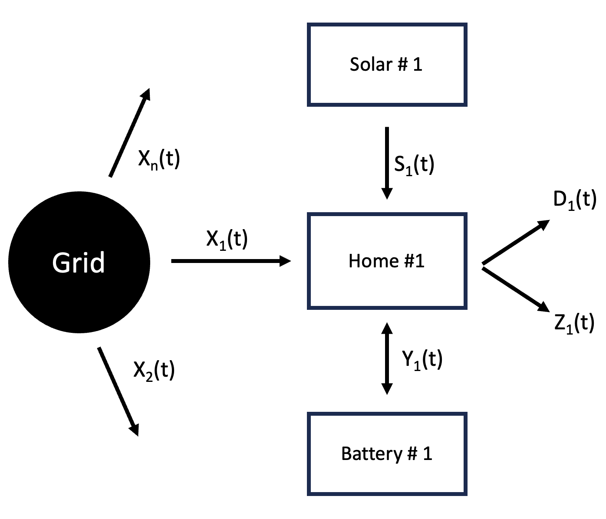
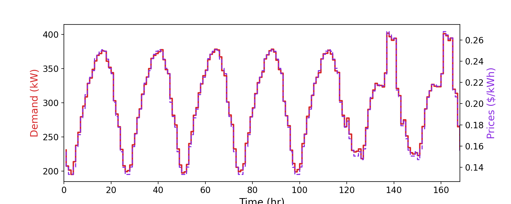
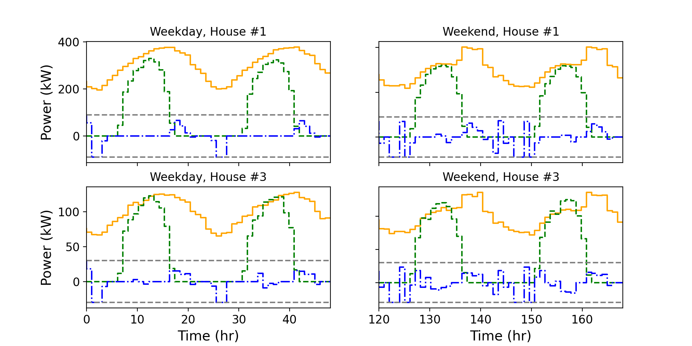
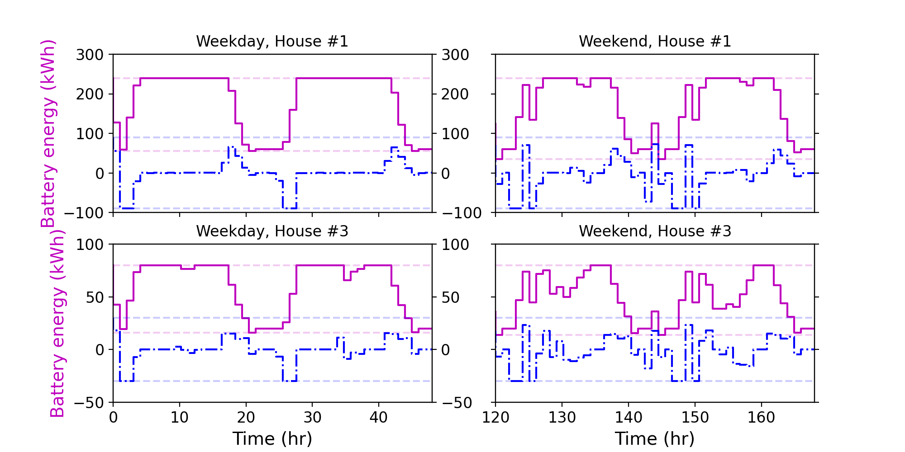

# Optimal Control of Residential Energy Storage Under Price Fluctuations

Course project for [AA 203](https://stanfordasl.github.io/aa203/sp2223/) class at Stanford Unviersity by Apoorv Srivastava and Dhvaneel Visaria. Detailed project report can be found [here](https://apoorv-s.github.io./assets/documents/projectReports/AA_203_Project.pdf).

The schematid diagram of the grid is shown along with the results obtained using MPC based control are shown below.

*Grid Schematic*

*Energy demands and prices*

*House Energy Supply*

*Battery Dynamics*
